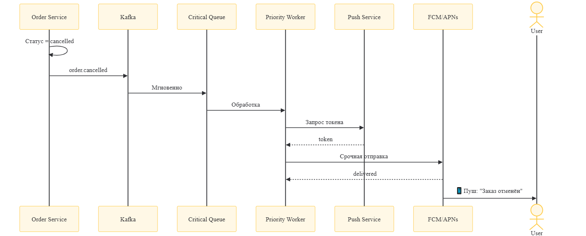

# Петрушка Зеленая — Архитектура PUSH-уведомлений

Верхнеуровневая архитектура системы отправки PUSH-уведомлений для мобильного приложения интернет-магазина.

## Общая схема

## Компоненты

| Компонент | Описание |
|-----------|----------|
| **Push Service** | Регистрация токенов, маршрутизация уведомлений |
| **RabbitMQ** | Очереди с приоритетами: critical, high, regular, scheduled |
| **Workers** | Обработчики очередей разной срочности |
| **FCM/APNs** | Провайдеры доставки push |

## Потоки данных

### Abandoned Cart

### Order Cancelled

## Типы уведомлений

| Тип | Триггер | Очередь | Задержка |
|-----|---------|---------|----------|
| Отмена заказа | Статус cancelled | Critical | 0 |
| Abandoned cart | Корзина неактивна 24ч | Scheduled | 24ч |
| Реклама | Ручной запуск | Regular | по расписанию |
